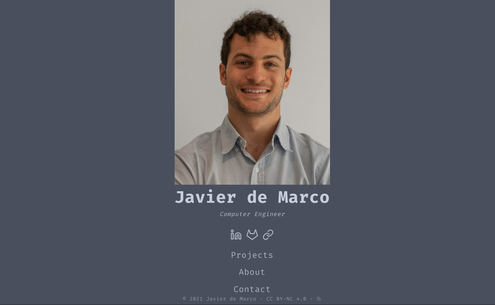

# Javier de Marco Website

  
  
  
  

---

### 🏠 [Homepage](https://github.com/javierdemarco/javierdemarcowebsite)

-------------------------------------------------------------------------------

Welcome to my personal website.

The language used to program the website is [Hugo](https://gohugo.io/ "Hugo Oficial Language Website"), a fast and flexible static site generator written in go.

I made this website to congregate in a single site all my knowledge and personal info in order to, in one hand create a space where i can express myself and estructure my thoughts and ideas. And in the other hand, as a professional portfolio to showcase my works which is sometimes hard to do in a single CV file.

I consider myself a tech and computer enthusiast with a dificult to evade eager to learn new things. This results in a unorganized and easy to forget the past knowledge learn due to new things coming in to fill the gap. As a solution, i build this website to manage this caos and bring it under control with the power of Markdown, Neovim, git and other technologies.

-------------------------------------------------------------------------------

## Contents
1. [[#Projects]]
2. [[#Personal Wiki]]
3. [[#About]]
4. [[#Contact]]

-------------------------------------------------------------------------------

### Projects
This is where i post my personal projects. They should all be hosted on gitlab and/or github where you can see the source code.

This projects represent my ideas come to life, or various exercises and learning i made that were worth pinging them up in a timeline.

### Personal Wiki
A wiki i try to maintain with computer, programming and Linux related knowledge i want to have always available so i can read it at any time.

### About
Mostly my _Curriculum Vitae_

[[about]]

### Contact
All the links and email accounts where you can contact me.

[[contact]]

## Author

👤 **Javier de Marco**

* Website: https://javierdemarco.netlify.com
* GitHub: [@javierdemarco](https://github.com/javierdemarco)
* LinkedIn: [@javierdemarcotomas](https://linkedin.com/in/javierdemarcotomas)

## 🤝 Contributing

Contributions, issues and feature requests are welcome! Feel free to check [issues page](https://github.com/javierdemarco/javierdemarcowebsite/issues).

## Show your support

Give a ⭐️ if this project helped you!

## 📝 License

Copyright © 2022 [Javier de Marco](https://github.com/javierdemarco). 
This project is [GNU GPL v3.0](https://github.com/javierdemarco/javierdemarcowebsite/blob/master/LICENSE) licensed.

***
_This README was generated with ❤️ by [readme-md-generator](https://github.com/kefranabg/readme-md-generator)
